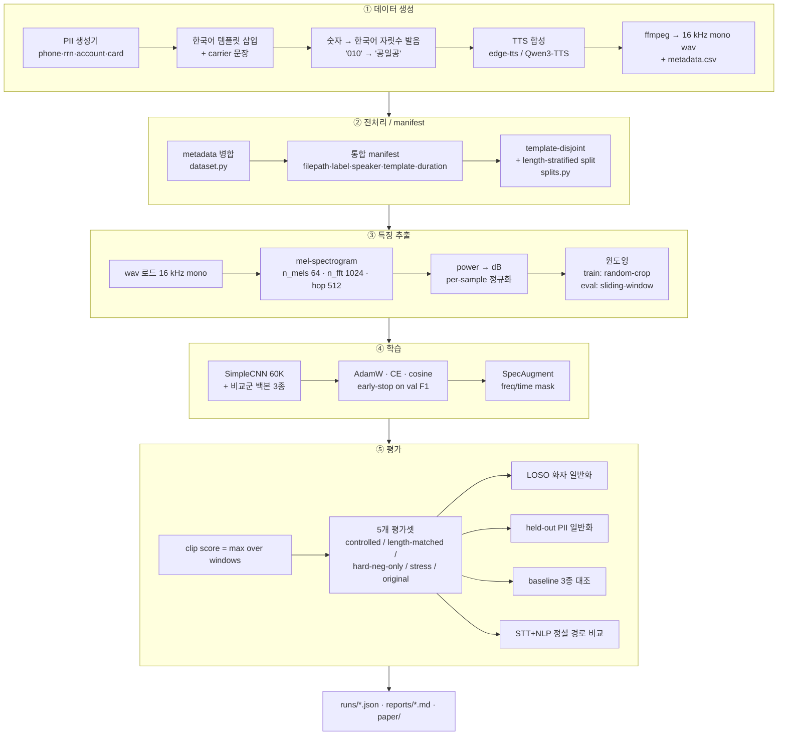
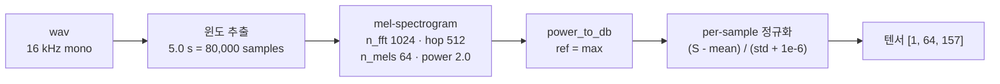
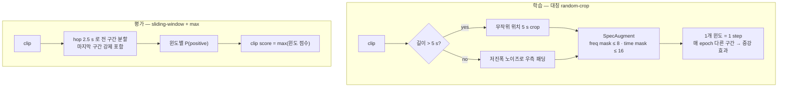
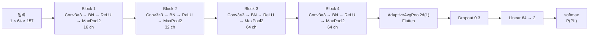
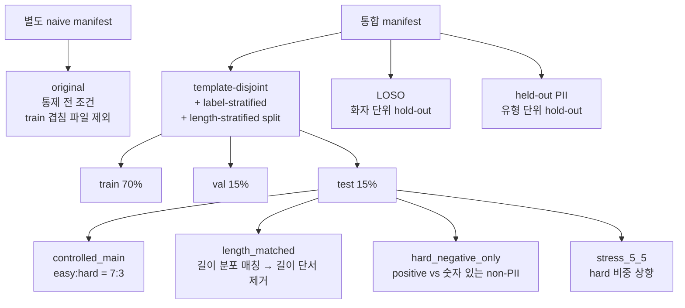
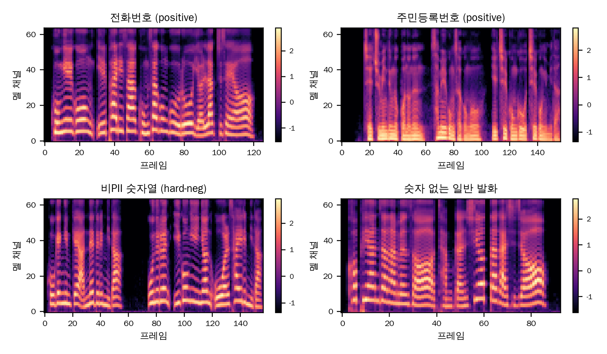
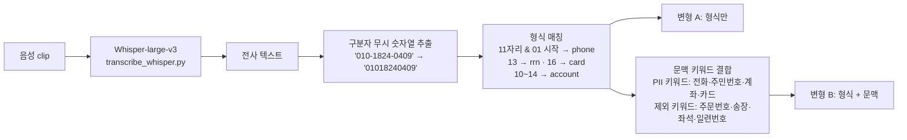
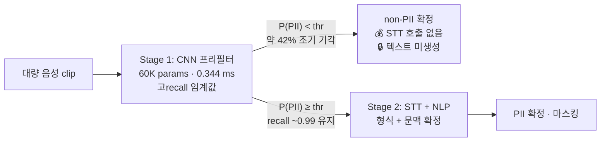

# CNN-Based Audio PII Classification

> **STT 없이** 음성의 멜 스펙트로그램만으로 개인정보(PII) 포함 여부를 판별하는 경량 CNN 프리필터.
> 전사(transcription) 단계를 건너뛰어 **민감 텍스트를 중간 산출물로 남기지 않는** 탐지 구조의 타당성(feasibility)을 통제 실험으로 검증한다.

| 핵심 지표 | 값 | 비교 |
|---|---|---|
| 통제 실험 F1 (v1, 전화번호) | **0.955** | 음향 통계 LR 기준선 0.761 |
| hard-negative FPR | **0.006** | "숫자만 있으면 반응"이 아님 |
| 미학습 화자 LOSO F1 (14화자) | **0.861 ± 0.102** | 3화자 시절 0.616 ± 0.280 |
| **미학습 PII 유형** recall | **0.88 ~ 0.98** | 주민·카드·계좌를 학습 없이 탐지 |
| 모델 크기 / 추론 | **60,706 params · 0.26 MB · 0.344 ms/window** | Whisper-large-v3 대비 약 **1,000× 빠름** |

논문 초안: [`src/cnn/paper/main.tex`](src/cnn/paper/main.tex) · [`main.pdf`](src/cnn/paper/main.pdf) · 전체 요약: [`src/cnn/SUMMARY.md`](src/cnn/SUMMARY.md)

---

## 1. 프로젝트 개요

### 1.1 문제 — 왜 STT를 거치지 않으려 하는가

음성에서 PII를 찾는 표준 방식은 **ASR로 전사 → NLP로 패턴 탐지**하는 캐스케이드다. 이 구조는 세 가지 구조적 한계를 갖는다.

| 한계 | 내용 |
|---|---|
| **비용·지연** | PII 유무와 무관하게 *모든* 발화를 전사해야 한다. 본 실험 측정값 Whisper-large-v3 ≈ 360 ms/clip vs CNN 0.344 ms/window |
| **민감 텍스트 중간 산출** | 전사 텍스트가 PII를 평문으로 담아 로그·캐시·저장소에 **새로운 유출 표면**을 만든다 |
| **전사 오류 전파** | 구어체 긴 숫자열에서 자릿수 누락 발생. 합성음(WER 중앙값 0)에서조차 카드 16자리 recall 0.852 |

### 1.2 접근 — 두 경로의 대비


핵심 가설은 **"PII 형식 숫자열은 고유한 음향·시간적 패턴을 가진다"** 는 것이다.
전화번호("공일공 일팔이사 공사공구")는 일반 발화나 주문번호와 달리 *3-4-4 자릿수 그룹 + 그룹 사이 짧은 멈춤 + 균일한 자릿수 발음 리듬* 이라는 구조를 스펙트로그램 상에 남긴다. CNN이 이 구조를 이미지 패턴으로 학습할 수 있는지를 검증한다.

### 1.3 무엇을 입증했는가

1. **분리 가능성** — 음향 통계 기반 LR 기준선(ROC 0.878)을 CNN이 크게 능가(F1 0.955 / ROC 0.997).
2. **artifact 의존이 아님** — 길이 단서(length-matched 평가에서 duration-only는 ROC 0.70→0.53 붕괴, CNN은 유지)나 "숫자 존재"(hard-neg FPR 0.006)에 기대지 않는다.
3. **화자 일반화** — 학습에 없던 화자로 평가(LOSO)해도 14화자 학습 시 F1 0.861로 안정.
4. **PII 유형 일반화** — 특정 PII 유형을 **학습에서 완전히 제외**하고 그 유형만으로 평가해도 recall 0.88~0.98. → 숫자열 암기가 아니라 "PII 형식" 자체를 일반화.
5. **정설 경로와의 정직한 비교** — 동일 데이터·동일 split에서 Whisper+NLP와 비교하여 상보성(CNN=고recall·초고속, STT+NLP=고precision)을 확인하고 2단계 파이프라인을 제안.

---

## 2. 전체 시스템 파이프라인



---

## 3. 데이터셋

실통화 데이터를 쓸 수 없으므로 **모든 데이터를 직접 합성**했다. 대신 합성 데이터에서 흔히 발생하는 shortcut(출처·길이·화자 누수)을 통제 불변식으로 차단했다.

### 3.1 두 세대

| 세트 | TTS | 화자 | PII 유형 | 규모 | 경로 |
|---|---|---|---|---|---|
| **v1** controlled | edge-tts | 3 | 전화번호 | ~2,000 | `src/cnn/data/`, `data/x/` |
| **v2** expanded | Qwen3-TTS | **14** | 전화·주민·계좌·카드 | 1,800 | `src/cnn/data_qwen/` |

### 3.2 3-클래스 설계 — hard negative가 실험의 핵심

단순히 "PII 발화 vs 일반 발화"로 나누면 모델이 **"숫자가 있는가"** 만 학습해도 높은 점수가 나온다. 이를 막기 위해 negative를 두 층으로 나눴다.

| 클래스 | label | 설계 의도 | 예시 |
|---|---|---|---|
| **positive** | 1 | PII 형식 숫자열 포함 | `제 전화번호는 공일공 일팔이사 공사공구입니다.`<br/>`제 주민등록번호는 삼일공사공오 일칠공구오칠공입니다.` |
| **hard negative** | 0 | **숫자는 있지만 PII 형식이 아님** → "숫자 존재" shortcut 차단 | `주문번호는 08471529364입니다.` (9~11자리)<br/>`제품 일련번호는 4821 7395 0164입니다.` (카드 유사 12자리)<br/>`좌석은 12열 34번입니다.` / `우편번호는 06236입니다.` |
| **easy negative** | 0 | 숫자 없는 일반 발화 | `오늘 날씨가 정말 화창하고 좋습니다.` |

구성비: `positive : negative = 1 : 1`, negative 내부 `easy : hard = 7 : 3`.
hard negative 카테고리 10종: date / order / invoice / price / postal / seat / serial / birth / bus / count.

### 3.3 통제 불변식 (leakage 차단)


- **읽는 방식 통제**: positive/hard-neg 모두 숫자를 자릿수 발음("공일공…")으로 읽는다. 한쪽만 "십 이십"처럼 읽으면 그것이 정답 단서가 된다.
- **패딩 통제**: 짧은 clip을 0(무음)으로 패딩하면 무음 길이가 곧 원본 길이를 알려준다 → 저진폭 노이즈로 패딩.
- **길이 통제**: carrier 문장(`안내 말씀드립니다.` 등)을 85% 확률로 앞뒤에 붙여 클래스 간 길이 분포를 겹치게 만들고, 추가로 length-matched 평가셋에서 검증.

### 3.4 화자 생성 방법 (v2) — 일관된 14화자 만들기

Qwen3-TTS의 VoiceDesign을 매 발화마다 호출하면 **같은 instruct라도 발화별 음색이 흔들린다**(within-speaker 분산 > between-speaker 분산, ratio 0.61). 즉 "14화자"가 실제로는 화자 정체성이 없는 상태가 된다. 이를 다음 2단계로 해결했다.


### 3.5 메타데이터 스키마

모든 소스는 `dataset.py`에서 아래 통합 스키마로 병합된다.

| 컬럼 | 용도 |
|---|---|
| `filepath` | 오디오 절대 경로 |
| `label` | 1 = PII 포함 / 0 = 미포함 |
| `source_type` | `positive` / `negative_hard` / `negative_easy` |
| `speaker_id` | LOSO 분할 키 |
| `template_id` | template-disjoint 분할 키 (없으면 문장 골격 해시로 파생) |
| `duration` | length-stratified split · length-matched 평가용 |
| `pool` | `controlled` / `original` |
| `pii_type` (v2) | `phone` / `rrn` / `account` / `card` — held-out PII 실험 키 |

---

## 4. 모델 구현 방법

### 4.1 오디오 → log-mel 스펙트로그램

CNN이 실제로 보는 입력은 아래 순서로 만들어진다 ([`dataset.py`](src/cnn/dataset.py) `wav_to_logmel`).



| 파라미터 | 값 | 근거 |
|---|---|---|
| `SAMPLE_RATE` | 16,000 | 전화 대역 표준, TTS 출력과 일치 |
| `N_MELS` | 64 | 자릿수 발음 구분에 충분한 주파수 해상도, 경량 유지 |
| `N_FFT` / `HOP_LENGTH` | 1024 / 512 | 64 ms 윈도 · 32 ms hop → 숫자 그룹 사이 짧은 멈춤 포착 |
| `WINDOW_SEC` | 5.0 | 전화번호 1회 발화를 한 윈도에 담는 길이 |
| `N_FRAMES` | 157 | `1 + 80000 // 512` |
| **입력 텐서** | `[1, 64, 157]` | 백본 비교군은 3채널 복제 `[3, 64, 157]` |

**per-sample 정규화**를 쓰는 이유: 클립별 전체 음량/녹음 레벨 차이가 클래스 단서로 새는 것을 막는다.

### 4.2 하이브리드 윈도 전략

clip 길이가 가변이므로 학습과 평가에서 다른 윈도 정책을 쓴다.



`max` 집계의 의미: PII는 clip 전체가 아니라 **어느 한 구간**에만 등장한다. 평균을 쓰면 긴 clip에서 PII 구간이 희석되므로, "한 구간이라도 PII면 PII"라는 탐지 문제의 성질에 맞춰 max를 쓴다.

### 4.3 SimpleCNN 아키텍처 (채택 모델)

직접 설계한 **60,706 파라미터** 4-블록 CNN ([`models/simple_cnn.py`](src/cnn/models/simple_cnn.py)).



텐서 shape 변화:

| 단계 | 출력 shape | 파라미터 |
|---|---|---|
| 입력 | `1 × 64 × 157` | – |
| Block 1 (→16 ch) | `16 × 32 × 78` | 192 |
| Block 2 (→32 ch) | `32 × 16 × 39` | 4,704 |
| Block 3 (→64 ch) | `64 × 8 × 19` | 18,624 |
| Block 4 (→64 ch) | `64 × 4 × 9` | 37,056 |
| GAP + Flatten | `64` | – |
| Dropout + Linear | `2` | 130 |
| **합계** | | **60,706** (0.26 MB) |

설계 의도:

- **Global Average Pooling** — Flatten+FC 대신 GAP를 쓰면 파라미터가 급감하고, 시간축 위치에 대한 불변성이 생긴다(PII가 윈도 어디에 있어도 동일하게 반응).
- **4단 다운샘플링** — 주파수축 64→4, 시간축 157→9. 자릿수 발음 리듬은 수백 ms 스케일이므로 이 정도 압축에서도 그룹 경계 패턴이 남는다.
- **얕고 좁게** — 데이터가 합성·소규모(~2K)이므로 표현력을 키우면 화자·템플릿에 과적합한다. 실제로 27.8 M ConvNeXt-Tiny는 seed 간 분산이 크게 흔들렸다(F1 0.804 ± 0.132).

### 4.4 학습 설정

| 항목 | 값 |
|---|---|
| Optimizer | AdamW (`lr 1e-4`, `weight_decay 1e-4`) |
| Loss | CrossEntropy |
| Scheduler | CosineAnnealingLR (`T_max = epochs`) |
| Batch / Epochs | 32 / 50 |
| Early stopping | val **clip-level F1** 기준, `patience 8`, best state 복원 |
| 증강 | SpecAugment (freq mask ≤ 8 bins, time mask ≤ 16 frames) + random-crop |
| Seeds | 42, 43, 44 (모든 결과는 seed 평균 ± 표준편차) |

**early stopping을 window F1이 아니라 clip F1로 하는 이유**: 운용 시 판정 단위가 clip이므로, 검증 지표도 sliding-window+max를 거친 clip 점수로 계산해 학습·평가 단위를 일치시킨다.

### 4.5 비교군 — 백본 3종과 baseline 3종

| 축 | 구성 | 목적 |
|---|---|---|
| **백본 비교** | MobileNetV3-Small (1.5 M) / EfficientNet-B0 (4.0 M) / ConvNeXt-Tiny (27.8 M) — ImageNet pretrained, 2-class 헤드 교체 | 경량 자체 설계가 대형 pretrained보다 이 과제에 유리한지 확인 |
| **하한 baseline** | ① majority ② duration-only LR ③ acoustic-feature LR (duration·RMS·ZCR·spectral centroid의 mean/std, 7차원) | CNN이 "스펙트로그램 패턴"을 학습했다고 주장하려면 **음향 통계만으로 가능한 수준**을 넘어야 한다 |

`duration-only` baseline이 특히 중요하다. 이것이 잘 맞으면 데이터셋이 길이로 풀리는 문제라는 뜻이므로, 이 baseline의 붕괴(length-matched에서 ROC 0.70→0.53)가 곧 통제 성공의 증거다.

---

## 5. 실험 설계 — 누수를 어떻게 막았는가



| 통제 | 방법 | 막으려는 누수 |
|---|---|---|
| **template-disjoint** | 같은 문장 골격(`template_id`)은 한 split에만. 골격 컬럼이 없는 소스는 숫자·공백 제거 후 해시로 파생 | train/test에 같은 템플릿이 걸쳐 "문장 암기"로 푸는 것 |
| **length-stratified** | template 그룹을 길이순 정렬 후 비례 충원 배정 | split 간 길이 분포 편향 |
| **original 정화** | controlled-train에 쓰인 `filepath`를 original 평가셋에서 제외 | easy negative가 `data/x` 공유 소스라 발생하는 파일 단위 중복 |
| **LOSO** | 화자 1명을 완전히 빼고 학습 → 그 화자만으로 평가 | 화자 음색 암기 |
| **held-out PII** | PII 유형 1종을 positive 학습에서 완전히 제외 → 그 유형만으로 평가 | 특정 숫자열 형식 암기 |

---

## 6. 결과

### 6.1 baseline 대비 — feasibility 성립 (v1, seed 3개 평균)

| Model | Params | Controlled F1 | Length-matched F1 | hard-neg FPR | ROC-AUC |
|---|---|---|---|---|---|
| majority | – | 0.000 | 0.000 | 0.000 | 0.500 |
| duration-only LR | – | 0.633 | 0.639 | 0.812 | 0.701 |
| acoustic-feature LR | – | 0.761 | 0.772 | 0.264 | 0.878 |
| **simple_cnn** | **60,706** | **0.955 ± 0.010** | **0.956 ± 0.011** | **0.006** | **0.997** |
| mobilenet_v3_small | 1.5 M | 0.776 | 0.777 | 0.021 | 0.945 |
| efficientnet_b0 | 4.0 M | 0.867 | 0.871 | 0.011 | 0.994 |
| convnext_tiny | 27.8 M | 0.804 ± 0.132 | 0.808 ± 0.127 | 0.056 | 0.962 |

→ 자체 설계 60K CNN이 **모든 대형 pretrained 백본을 능가**. 소규모 합성 데이터에서 ImageNet 표현이 이 과제에 도움되지 않음을 시사.

### 6.2 효율성

| Model | Params | Size | GPU ms/window |
|---|---|---|---|
| **simple_cnn** | 60,706 | **0.26 MB** | **0.344** |
| mobilenet_v3_small | 1,519,906 | 6.21 MB | 2.034 |
| efficientnet_b0 | 4,010,110 | 16.34 MB | 2.916 |
| convnext_tiny | 27,821,666 | 111.35 MB | 2.323 |

### 6.3 화자 일반화 (LOSO)

| LOSO | v1 (3화자) | **v2 (14화자)** |
|---|---|---|
| F1 @ 0.5 | 0.616 ± **0.280** | **0.861 ± 0.102** |
| recall @ 0.5 | 0.712 ± 0.410 | 0.891 ± 0.180 |
| ROC-AUC | 0.992 | 0.964 ± 0.030 |

3화자 시절에는 ROC는 높은데 F1이 출렁였다 — 화자별로 최적 임계값이 어긋나 고정 0.5가 맞지 않았기 때문이다. 14화자로 늘리자 **분산이 1/3로 줄고**, val-튜닝 임계값(0.855)과 고정 0.5(0.861)의 차이가 사라져 운용점도 안정됐다.

### 6.4 PII 유형 일반화 (held-out PII) — 가장 강한 증거

각 유형을 학습에서 **완전히 제외**하고 그 유형만으로 평가:

| 제외한 PII | held-out recall @ 0.5 | ROC-AUC |
|---|---|---|
| 주민등록번호 (13자리) | **0.978** | 0.935 |
| 카드번호 (16자리) | **0.911** | 0.968 |
| 계좌번호 (가변) | **0.884** | 0.938 |

전화번호 등만 배운 모델이 한 번도 본 적 없는 주민번호를 recall 0.978로 잡는다. 모델이 학습한 것은 특정 숫자열이 아니라 **"PII 형식 숫자열의 음향적 서명"** 이다.

학습에서 제외한 4개 샘플의 실제 예측: 전화 0.973 · 주민 0.989 (PII) / hard-neg 0.107 · 일반 0.030 (non-PII) → 4/4 정답.

### 6.5 모델이 보는 입력



논문 figure: [`paper/figs/`](src/cnn/paper/figs/) — `loso_v1_v2.pdf` · `precision_by_category.pdf` · `efficiency.pdf` · `cnn_vs_sttnlp.pdf`

---

## 7. 정설 경로(STT+NLP)와의 비교, 그리고 2단계 파이프라인

### 7.1 비교 대상 구현



Whisper는 한글 자릿수를 아라비아 숫자로 정규화하지만 하이픈/공백 그룹핑은 발화 멈춤 기준으로 임의로 넣는다. 그래서 구분자를 무시하고 **인접 숫자 그룹을 하나의 숫자열로 묶은 뒤** 자릿수·선두 패턴으로 판정한다.

### 7.2 동일 데이터·동일 test split (v2, n = 331)

| 접근 | F1 | recall | precision | hard-neg FPR | 지연 |
|---|---|---|---|---|---|
| **CNN (음향)** | 0.826 | **0.989** | 0.708 | 0.542 | **0.344 ms/window** |
| STT+NLP (형식만) | 0.883 | 0.921 | 0.849 | 0.218 | ~360 ms/clip |
| **STT+NLP (형식+문맥)** | **0.935** | 0.921 | **0.951** | **0.063** | ~360 ms/clip |

- **precision은 문맥의 몫**: CNN이 못 풀던 약점(주문번호 등 형식 충돌 숫자열 과다검출)을 STT+NLP는 *선행 단어* 로 해결한다. 이는 "CNN의 precision 문제는 calibration이 아니라 문맥 부재 때문"이라는 진단([`progress/0012`](src/cnn/progress/0012-2026-06-15-precision-calibration.md))과 일치한다. temperature scaling(T = 2.85)·Platt은 ECE를 유의하게 개선하지 못했다(raw 0.135 → temp 0.142 / Platt 0.112).
- **recall·속도는 CNN의 몫**: recall 0.989 vs 0.921, 속도 약 1,000배. STT+NLP의 recall 손실은 주로 **카드 16자리 0.852** — Whisper가 긴 숫자열에서 자릿수를 누락·분절하기 때문.

### 7.3 ⚠️ 합성 데이터는 STT에 유리하다 (정직한 명시)

일반 발화 450건 기준 Whisper 전사 품질은 **WER 중앙값 0, 완벽일치 80%**, 환각 1건. 즉 위 STT+NLP 수치는 **합성 환경에서의 best-case 상한**이다. 실통화(잡음·억양·코덱)에서는 WER이 올라 STT+NLP가 열화되므로 실제 격차는 더 좁거나 역전될 수 있다. 그럼에도 best-case에서조차 긴 숫자열 recall이 새는 점은 캐스케이드의 구조적 약점이다.

### 7.4 결론 — 상보적 2단계 설계



v1 통제 조건에서 recall ≈ 0.99를 유지하며 **STT 호출을 약 42% 절감**했다. 고recall 저비용 1차 선별(CNN) + 고precision 문맥 확정(STT+NLP)의 조합이 두 접근의 장점을 결합한다.

---

## 8. 저장소 구조

```text
cnn-based-audio-pii-classification/
├─ README.md
├─ data/                            # v1 데이터 (o = naive positive, x = easy negative)
│  ├─ o/ · x/
└─ src/
   ├─ generate/                     # v1 edge-tts 생성기
   │  ├─ generate_o_1.py · generate_o_2.py · generate_x_1.py
   └─ cnn/
      ├─ config.py                  # 경로·mel·윈도·split seed 중앙 설정
      ├─ features.py                # 수작업 음향 feature (baseline용, 캐시)
      ├─ dataset.py                 # manifest 병합 · log-mel · 하이브리드 윈도 · 5개 평가셋
      ├─ splits.py                  # template-disjoint + length-stratified split
      ├─ models/
      │  ├─ simple_cnn.py           # ★ 채택 모델 (60,706 params)
      │  └─ backbones.py            # MobileNetV3-S / EfficientNet-B0 / ConvNeXt-T
      ├─ engine.py                  # 학습 루프 + clip-level sliding-window max 추론
      ├─ metrics.py                 # F1/recall/ROC/PR + hard-neg FPR
      ├─ train.py                   # (model, seed) 1조합 학습
      ├─ evaluate.py                # 5개 평가셋 × seed 집계
      ├─ baselines.py               # majority / duration-only / acoustic-LR
      ├─ speaker_robustness.py      # v1 LOSO
      ├─ speaker_pii_experiment.py  # v2 in-dist + 14화자 LOSO + held-out PII
      ├─ calibration_analysis.py    # temperature / Platt · ECE · 임계값 운용표
      ├─ precision_diagnosis.py     # hard-neg 카테고리별 FPR 원인 진단
      ├─ infer.py                   # 단일 wav 추론 데모
      ├─ viz_melspec.py · predict_viz_samples.py
      ├─ generate/
      │  ├─ qwen_voicebank.py       # VoiceDesign → Base clone 14화자 생성
      │  ├─ qwen_speaker_consistency.py
      │  ├─ generate_qwen.py        # v2 데이터 생성 (4 PII + hard/easy)
      │  ├─ generate_pos.py · generate_neg_hard.py
      │  └─ voicebank/              # spk01~14_ref.wav + roster.csv
      ├─ stt/                       # 정설 경로 비교
      │  ├─ transcribe_whisper.py   # Whisper-large-v3 전사 + 캐시
      │  ├─ nlp_pii_detector.py     # 규칙 기반 탐지 (형식 / 형식+문맥)
      │  └─ eval_stt_nlp.py         # 동일 split 비교 평가
      ├─ data/ · data_qwen/         # 생성된 오디오 + metadata
      ├─ runs/                      # 체크포인트 + 모든 수치 (*.json)
      ├─ reports/                   # results / conclusion / cnn_vs_sttnlp / 분석 문서
      ├─ progress/                  # 0001~0013 단계별 작업 기록
      ├─ paper/                     # main.tex · main.pdf · figs · refs.bib
      ├─ plan.md · plan2 · plan3    # 실험 설계 문서
      └─ SUMMARY.md                 # 전체 요약
```

---

## 9. 재현 방법

### 9.1 환경

```bash
conda create -n audio-pii python=3.11 && conda activate audio-pii
pip install torch torchvision librosa soundfile pandas numpy scikit-learn matplotlib edge-tts
# STT 비교 경로에만 필요
pip install transformers accelerate jiwer
```

검증 환경: Python 3.11 · torch 2.12+cu130 · torchvision 0.27 · librosa 0.11 · H100 NVL × 4 · ffmpeg 4.4.2
(`ffmpeg`는 시스템 PATH에 등록되어야 한다 — TTS mp3 → 16 kHz mono wav 변환에 사용)

### 9.2 데이터 생성

```bash
cd src/cnn/generate
python generate_pos.py                  # v1 positive (전화번호)
python generate_neg_hard.py             # v1 hard negative (10 카테고리)
python qwen_voicebank.py                # v2 14화자 reference 생성
python generate_qwen.py                 # v2 1,800 clips (4 PII + hard + easy)
```

### 9.3 학습 · 평가 (v1 통제 실험)

```bash
cd src/cnn
python dataset.py                                          # smoke: manifest·텐서 shape 확인
python baselines.py                                        # 하한 3종 → runs/baselines.json

for m in simple_cnn mobilenet_v3_small efficientnet_b0 convnext_tiny; do
  for s in 42 43 44; do python train.py --model $m --seed $s; done
done

python evaluate.py --models simple_cnn mobilenet_v3_small efficientnet_b0 convnext_tiny \
                   --seeds 42 43 44                        # → runs/evaluation.json
```

### 9.4 일반화 실험

```bash
python speaker_robustness.py --model simple_cnn --seeds 42 43 44      # v1 LOSO
python speaker_pii_experiment.py --indist --loso                      # v2 in-dist + 14화자 LOSO
python speaker_pii_experiment.py --heldpii --held rrn                 # 유형 제외 학습 (rrn|card|account)
python calibration_analysis.py                                        # temperature/Platt · 운용표
python precision_diagnosis.py                                         # hard-neg 카테고리별 FPR
```

### 9.5 STT+NLP 정설 경로 비교

```bash
python stt/transcribe_whisper.py --smoke     # 3개만 전사해 동작 확인
python stt/transcribe_whisper.py             # 전 클립 전사 → data_qwen/transcripts.csv
python stt/eval_stt_nlp.py                   # → runs/stt_nlp_eval.json
```

### 9.6 단일 파일 추론

```bash
python infer.py --wav path/to/audio.wav --model simple_cnn --seed 42 --threshold 0.5
```

대부분의 스크립트는 `--smoke` 플래그로 소규모 1-epoch 검증을 지원한다. split은 `build_controlled_manifest(seed) + split_manifest(seed)`의 결정성으로 재현되므로, 같은 seed면 `train.py`와 `evaluate.py`가 동일한 train/val/test를 복원한다.

---

## 10. 한계와 향후 과제

정직하게 명시한다.

| 한계 | 내용 |
|---|---|
| **운용 precision** | v2에서 4 PII + 어려운 hard-neg로 과제가 어려워지자 고정 임계값 0.5에서 과다검출(in-dist hard-neg FPR 0.542, LOSO 0.251). ROC는 견고(0.90~0.96). calibration(temperature/Platt)으로는 개선되지 않았고 — **문맥 정보가 필요하다**는 것이 진단 결과다. |
| **합성 음성** | 전 데이터가 TTS 합성이며 v2는 단일 Qwen 계열. 실통화의 잡음·억양·코덱·중첩 발화 gap이 남아 있다. 14화자도 설계 합성 화자로, 최근접 쌍은 marginal. |
| **주장 범위** | 본 결과는 **PII 형식 숫자열의 음향 탐지 feasibility**에 한정된다. 문맥상 실제 PII인지 여부의 판단이나 STT 정설 경로의 *대체* 가능성은 주장하지 않는다. |

다음 후보:

1. **precision 개선** — hard-negative 비중·난이도 상향, 문맥 결합(음향 + 경량 키워드 스포팅), threshold 독립 운용
2. **실데이터 검증** — 실통화 녹취에서 열화 민감도 측정
3. **다양성 확대** — 복수 TTS 엔진·실화자, 잡음·코덱 augmentation
4. **2단계 파이프라인 end-to-end 평가** — 비용·recall·지연 trade-off 곡선

---

## 11. 문서 맵

| 문서 | 내용 |
|---|---|
| [`src/cnn/SUMMARY.md`](src/cnn/SUMMARY.md) | 전체 작업 요약 (v1 → v2) |
| [`src/cnn/plan.md`](src/cnn/plan.md) | v1 통제 실험 설계 (§ 번호는 코드 주석에서 참조됨) |
| [`src/cnn/plan2_qwen_speaker_pii_expansion.md`](src/cnn/plan2_qwen_speaker_pii_expansion.md) | v2 화자·PII 확장 설계 |
| [`src/cnn/plan3_stt_nlp_pipeline.md`](src/cnn/plan3_stt_nlp_pipeline.md) | STT+NLP 비교 설계 |
| [`src/cnn/reports/results.md`](src/cnn/reports/results.md) | v1 전체 수치표 |
| [`src/cnn/reports/conclusion.md`](src/cnn/reports/conclusion.md) | 결과 해석 |
| [`src/cnn/reports/why_simplecnn_and_feasibility.md`](src/cnn/reports/why_simplecnn_and_feasibility.md) | simple_cnn 우위 근거 |
| [`src/cnn/reports/cnn_vs_sttnlp.md`](src/cnn/reports/cnn_vs_sttnlp.md) | 정설 경로 비교 |
| [`src/cnn/progress/`](src/cnn/progress/) | 0001~0013 단계별 작업 기록 |
| [`src/cnn/rebuttal.md`](src/cnn/rebuttal.md) · [`rebuttal2_sec.md`](src/cnn/rebuttal2_sec.md) | 예상 반론과 대응 |
| [`src/cnn/paper/main.tex`](src/cnn/paper/main.tex) | 논문 초안 |
